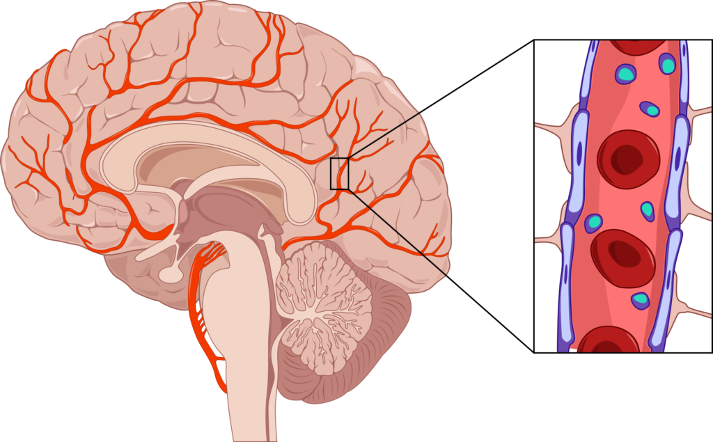

#+SETUPFILE: https://fniessen.github.io/org-html-themes/org/theme-readtheorg.setup
#+HTML_HEAD_EXTRA: <link rel="stylesheet" type="text/css" href="../center.css"/>
#+TITLE: BBB(Blood-Brain Barrier)
#+AUTHOR: Dean Seo (deaniac.seo@gmail.com)
#+DATE:  <2024-05-26 일 08:01>
#+options: timestamp:nil

* Table of Contents
- [[#once-upon-a-time-][Once upon a time ...]]
- [[#bbbblood-brain-barrier][BBB(Blood-Brain Barrier)]]
- [[#well-known-drugs-that-enter-the-bbb-with-side-effects][Well-known drugs that enter the BBB with side-effects]]
  - [[#caffein-and-coffee][Caffein and coffee]]
  - [[#adderall][Adderall]]

* Once upon a time ...
:PROPERTIES:
:CUSTOM_ID: once-upon-a-time-
:END:
#+begin_warning
*Disclaimer*

If you're looking for a medical advice, plase go see a doctor for consultation. (/No, I'm *not* a doctor./) \\
This posting may have errors or inaccurate/misleading information by mistake.
#+end_warning

When I was a kid, I got sick once and my doctor gave me a 10mg of Cetirizine, a very common anti-histamine pill that you can even buy at a 7/11 today.
After taking the pill, I felt sleepy.

I told my doctor about it and he explained that still, Cetirizine was the best choice, saying other similar medicines would make me even more drowsy, 

At the time, I didn't really understand why a pill would have that side effect.
I mean, I thought it should make me feel more /energetic/...? because it's supposed to kill those "evil allergy germs," so I get /helthier/, right?

Of course, now I know there's no such thing as evil allergy germs.
Certain drugs make us feel:

- Tired
- Excited
- Awake

There have been many studies describing why that happens.
Although it's a complicated matter, the (superficial) mechanism itself is simple. It all comes down to how our "brain" works!

* BBB(Blood-Brain Barrier)
:PROPERTIES:
:CUSTOM_ID: bbbblood-brain-barrier
:END:
Our brain has a barrier that selectively allows certain substances to pass from the bloodstream into the brain. 
The *Blood-Brain Barrier (BBB)* is this selective barrier that separates the blood from the brain's extracellular fluid in the CNS(Central Nervous System).

Its main function is to protect the brain from harmful substances while allowing essential nutrients to enter.

#+ATTR_HTML: :width 300px :class center

/Figure 1. An image of Blood-Brain Barrier in the brain, (Taken from "Cordance Medical"/).

Generally, lipid-soluble molecules, which are "oil-friendly," can pass through the BBB, whereas water-soluble molecules cannot. \\
Some drugs /happen to/ cross the BBB even though we don't want them to, while some others drugs (most of psychoactive drugs) are specifically designed to do so.

* Well-known drugs that enter the BBB with side-effects
:PROPERTIES:
:CUSTOM_ID: well-known-drugs-that-enter-the-bbb-with-side-effects
:END:
** Caffein and coffee
:PROPERTIES:
:CUSTOM_ID: caffein-and-coffee
:END:
Arguably, the most loved drug among people today is coffee, though you don't need a doctor's prescription.
Caffeine in tne coffee can cross the BBB and block adenosine receptors.

Adenosine makes you feel calm, but when caffeine blocks its receptors, your brain can't calm down, resulting in a state of alertness.
Too much caffeine can lead to excessive alertness, causing side effects like insomnia, as shown below:

#+begin_example
  Step 1: Caffeine Ingestion
        |
        v
  +-----------------------+
  |  Caffeine enters the  |
  |    blood stream        |
  +-----------------------+
        |
        v
  Step 2: Caffeine Crosses the BBB
        |
        v
  +-----------------------+    +-----------------------+
  |   Caffeine crosses    | -> |   Caffeine reaches    |
  |   the Blood-Brain     |    |      the brain        |
  |       Barrier         |    +-----------------------+
  +-----------------------+            |
                                       v
  Step 3: Blocking Adenosine Receptors
                                       |
                                       v
  +-----------------------+    +-----------------------+    +-----------------------+
  |   Caffeine binds to   | -> |  Adenosine receptors  | -> |  Blocking adenosine   |
  |  adenosine receptors  |    |      are blocked      |    |  reduces the calming  |
  +-----------------------+    +-----------------------+    |       effect          |
                                                            +-----------------------+
                                                                   |
                        +------------------------------------------+                                           
                        |
                        v
  Step 4: Increased Alertness
                        |                                            
                        v                                           
  +-----------------------+    +-----------------------+
  |  State of alertness   | -> | Excessive alertness   |
  |    is maintained      |    | can lead to insomnia  |
  +-----------------------+    |      and anxiety      |
                               +-----------------------+
#+end_example

** Adderall
:PROPERTIES:
:CUSTOM_ID: adderall
:END:
The notorious drug Adderall uses a similar mechanism.
It's designed to cross the BBB and directly stimulates the release of dopamine, disrupting the brain's natural reuptake process.

That results in a hyper-alertness, stronger than the /regular/ alertness caused by caffeine as described above, which merely blocks some adenosine receptors.

* Conclusion
.

