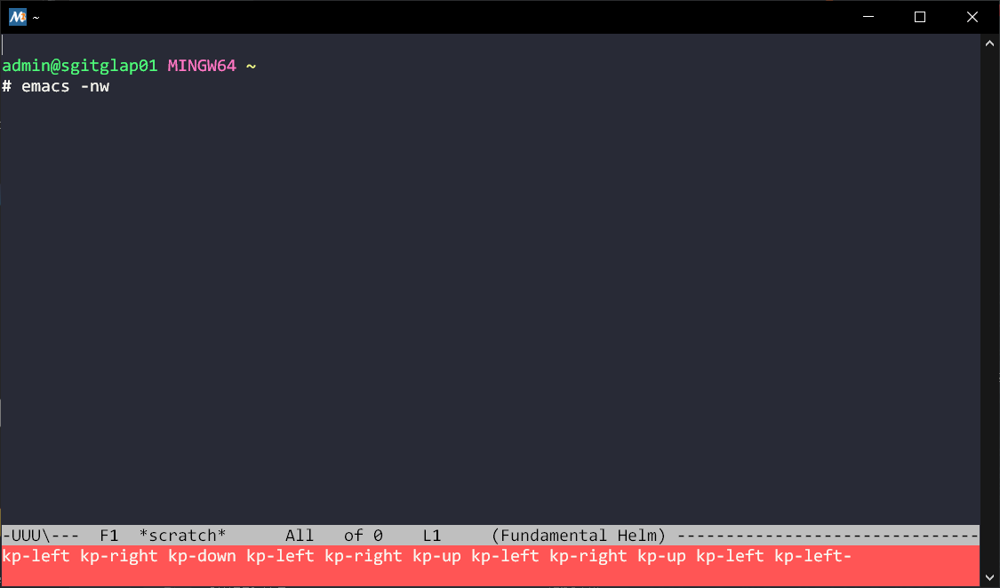

#+SETUPFILE: https://fniessen.github.io/org-html-themes/org/theme-readtheorg.setup
#+HTML_HEAD_EXTRA: <link rel="stylesheet" type="text/css" href="../center.css"/>
#+TITLE: Building Emacs on MSys2 in Windows
#+AUTHOR: Dean Seo (deaniac.seo@gmail.com)
#+DATE:  [2024-08-25 Sun]
#+options: timestamp:nil

* Table of Contents

* Emacs in Windows
In general, Windows isn't the best platform to run Emacs.
You'd have to /redo/ your own configurations just for Windows.

Plus, it's /really/ slow. In GUI, Magit, one of the killer packages in Emacs, crawls like a turtle.
#+begin_note
To be fair, it's neither Magit's nor Emacs's fault.
This is unfortunately due to how Windows executable runs with *emacs.exe* and *git.exe*.
#+end_note

Nevertheless, I think the situation improves a bit on [[https://www.msys2.org/][MSys2]], if you run Emacs in terminal mode by =emacs -nw=.
As of 2024 August, the default Emacs package available is *Emacs 27.2*, which works pretty well in terminal
like you would in Linux.

Yet, if you are an Emacs user, you'd certainly wanna use *Emacs 29* and take advantage of its fancy features such as
native compiliation through =libgccjit= bindings, tree-sitter, and etc.

In fact, you can download *Emacs 29* via Pacman, as follows:
#+BEGIN_SRC shell
  # This will give you Emacs 29.4 or above now
  $ pacman -S mingw-w64-x86_64-emacs
#+END_SRC

This works, /partially/.
The problem is that you'll have to stick to the GUI mode because it won't work in terminal as the whole screen gets garbled:

#+ATTR_HTML: :width 200px :class center

You'd have to either run it as a GUI application or use it with an alternative tool such [[https://github.com/rprichard/winpty][winpty]].

The reason *Emacs 27.2* works in terminal whilst *Eamcs 29* doesn't, I speculate, is that the latter one was built
using the [[https://mirrors.kernel.org/gnu/emacs/windows/][Windows source tarball]] instead of [[https://mirror.us-midwest-1.nexcess.net/gnu/emacs/][GNU Emacs]]. \\
To use Emacs 29 in terminal on Windows, unfortunately, we have to build Emacs on MSys2 from scratch.
#+begin_tip
This post is explicitly about the usage _within MSys2_.

Admittedly, there are other pracitces people do, /outside MSys2/.
One is to download the official binaries for Windows and run it properly on GUI

Another way is to use [[https://apps.microsoft.com/detail/9n0dx20hk701?hl=en-US&gl=US][Windows Terminal]].
I have never used Windows Terminal so I will put that approach aside here.
#+end_tip

* Building Emacs in MSys2 on Windows

